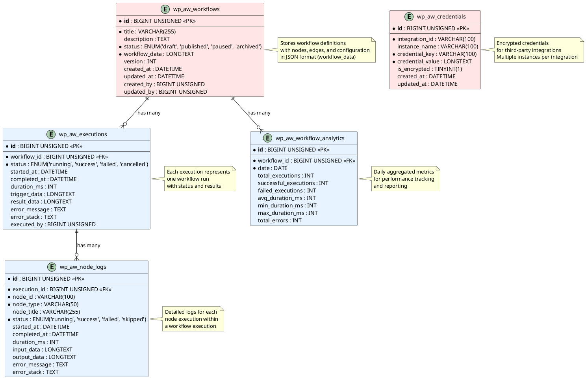
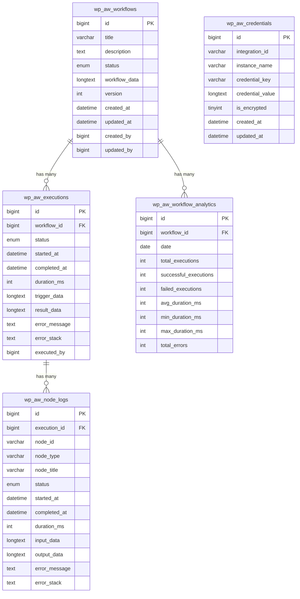

# Database Schema

## Overview

The plugin uses WordPress database tables to store workflows, nodes, executions, and logs.

## UML Diagrams

### PlantUML Class Diagram

This diagram shows the database schema and relationships between tables.



### Mermaid ER Diagram

Alternative representation using Mermaid syntax:



### Visual ASCII Representation

```
┌─────────────────────────────────┐
│   wp_aw_workflows               │
│   (Workflow Definitions)         │
│                                  │
│   PK: id                         │
│   - title                        │
│   - status                       │
│   - workflow_data (JSON)         │
└──────────┬──────────────────────┘
           │
           │ 1:N
           │
    ┌──────┴──────────────┬──────────────────┐
    │                     │                  │
    │                     │                  │
    ▼                     ▼                  ▼
┌─────────────┐  ┌──────────────────┐  ┌──────────────────┐
│ executions  │  │ node_logs        │  │ analytics        │
│             │  │                  │  │                  │
│ PK: id      │  │ PK: id           │  │ PK: id           │
│ FK:         │  │ FK: execution_id │  │ FK: workflow_id  │
│ workflow_id │  │                  │  │                  │
└─────────────┘  └──────────────────┘  └──────────────────┘
     │
     │ 1:N
     │
     ▼
┌──────────────────┐
│ node_logs        │
│ (Node Execution) │
│                  │
│ PK: id           │
│ FK: execution_id │
└──────────────────┘

┌──────────────────┐
│ credentials      │
│ (Standalone)     │
│                  │
│ PK: id           │
│ No FK            │
└──────────────────┘
```

## Relationship Details

### 1. Workflows → Executions (One-to-Many)
- **Relationship**: One workflow can have many executions
- **Foreign Key**: `wp_aw_executions.workflow_id` → `wp_aw_workflows.id`
- **Cascade**: ON DELETE CASCADE (deleting a workflow deletes its executions)
- **Cardinality**: 1:N

### 2. Workflows → Analytics (One-to-Many)
- **Relationship**: One workflow can have many analytics records (one per day)
- **Foreign Key**: `wp_aw_workflow_analytics.workflow_id` → `wp_aw_workflows.id`
- **Cascade**: ON DELETE CASCADE
- **Cardinality**: 1:N
- **Unique Constraint**: One record per workflow per date

### 3. Executions → Node Logs (One-to-Many)
- **Relationship**: One execution can have many node logs
- **Foreign Key**: `wp_aw_node_logs.execution_id` → `wp_aw_executions.id`
- **Cascade**: ON DELETE CASCADE (deleting an execution deletes its node logs)
- **Cardinality**: 1:N

### 4. Credentials (Standalone)
- **Relationship**: No foreign key relationships
- **Index**: Composite index on `(integration_id, instance_name)`
- **Purpose**: Stores encrypted credentials independently

## Tables

### 1. Workflows Table (`wp_aw_workflows`)

Stores workflow definitions.

```sql
CREATE TABLE wp_aw_workflows (
    id BIGINT UNSIGNED AUTO_INCREMENT PRIMARY KEY,
    title VARCHAR(255) NOT NULL,
    description TEXT,
    status ENUM('draft', 'published', 'paused', 'archived') DEFAULT 'draft',
    workflow_data LONGTEXT NOT NULL,  -- JSON: nodes, edges, configuration
    version INT DEFAULT 1,
    created_at DATETIME DEFAULT CURRENT_TIMESTAMP,
    updated_at DATETIME DEFAULT CURRENT_TIMESTAMP ON UPDATE CURRENT_TIMESTAMP,
    created_by BIGINT UNSIGNED,
    updated_by BIGINT UNSIGNED,
    INDEX idx_status (status),
    INDEX idx_created_at (created_at)
);
```

**Fields**:
- `id`: Unique workflow ID
- `title`: Workflow name
- `description`: Optional description
- `status`: Workflow state (draft, published, paused, archived)
- `workflow_data`: JSON containing nodes, edges, and configuration
- `version`: Version number for history tracking
- `created_at`, `updated_at`: Timestamps
- `created_by`, `updated_by`: User IDs

### 2. Workflow Executions Table (`wp_aw_executions`)

Stores workflow execution records.

```sql
CREATE TABLE wp_aw_executions (
    id BIGINT UNSIGNED AUTO_INCREMENT PRIMARY KEY,
    workflow_id BIGINT UNSIGNED NOT NULL,
    status ENUM('running', 'success', 'failed', 'cancelled') DEFAULT 'running',
    started_at DATETIME DEFAULT CURRENT_TIMESTAMP,
    completed_at DATETIME,
    duration_ms INT,
    trigger_data LONGTEXT,  -- JSON: data from trigger
    result_data LONGTEXT,   -- JSON: final result
    error_message TEXT,
    error_stack TEXT,
    executed_by BIGINT UNSIGNED,
    FOREIGN KEY (workflow_id) REFERENCES wp_aw_workflows(id) ON DELETE CASCADE,
    INDEX idx_workflow_id (workflow_id),
    INDEX idx_status (status),
    INDEX idx_started_at (started_at)
);
```

**Fields**:
- `id`: Unique execution ID
- `workflow_id`: Reference to workflow
- `status`: Execution status
- `started_at`, `completed_at`: Timestamps
- `duration_ms`: Execution duration in milliseconds
- `trigger_data`: Data that triggered the workflow
- `result_data`: Final result/output
- `error_message`, `error_stack`: Error details if failed
- `executed_by`: User ID who triggered (if manual)

### 3. Node Execution Logs Table (`wp_aw_node_logs`)

Stores individual node execution details.

```sql
CREATE TABLE wp_aw_node_logs (
    id BIGINT UNSIGNED AUTO_INCREMENT PRIMARY KEY,
    execution_id BIGINT UNSIGNED NOT NULL,
    node_id VARCHAR(100) NOT NULL,
    node_type VARCHAR(50) NOT NULL,
    node_title VARCHAR(255),
    status ENUM('running', 'success', 'failed', 'skipped') DEFAULT 'running',
    started_at DATETIME DEFAULT CURRENT_TIMESTAMP,
    completed_at DATETIME,
    duration_ms INT,
    input_data LONGTEXT,    -- JSON: input to node
    output_data LONGTEXT,   -- JSON: output from node
    error_message TEXT,
    error_stack TEXT,
    FOREIGN KEY (execution_id) REFERENCES wp_aw_executions(id) ON DELETE CASCADE,
    INDEX idx_execution_id (execution_id),
    INDEX idx_node_id (node_id),
    INDEX idx_status (status)
);
```

**Fields**:
- `id`: Unique log ID
- `execution_id`: Reference to execution
- `node_id`: Node identifier
- `node_type`: Type of node (trigger, action, agent, etc.)
- `node_title`: Node display name
- `status`: Node execution status
- `started_at`, `completed_at`: Timestamps
- `duration_ms`: Node execution duration
- `input_data`: Data received by node
- `output_data`: Data produced by node
- `error_message`, `error_stack`: Error details if failed

### 4. Credentials Table (`wp_aw_credentials`)

Stores encrypted credentials for integrations.

```sql
CREATE TABLE wp_aw_credentials (
    id BIGINT UNSIGNED AUTO_INCREMENT PRIMARY KEY,
    integration_id VARCHAR(100) NOT NULL,
    instance_name VARCHAR(100) DEFAULT 'default',
    credential_key VARCHAR(100) NOT NULL,
    credential_value LONGTEXT NOT NULL,  -- Encrypted
    is_encrypted TINYINT(1) DEFAULT 1,
    created_at DATETIME DEFAULT CURRENT_TIMESTAMP,
    updated_at DATETIME DEFAULT CURRENT_TIMESTAMP ON UPDATE CURRENT_TIMESTAMP,
    INDEX idx_integration (integration_id, instance_name)
);
```

### 5. Workflow Analytics Table (`wp_aw_workflow_analytics`)

Aggregated analytics for performance tracking.

```sql
CREATE TABLE wp_aw_workflow_analytics (
    id BIGINT UNSIGNED AUTO_INCREMENT PRIMARY KEY,
    workflow_id BIGINT UNSIGNED NOT NULL,
    date DATE NOT NULL,
    total_executions INT DEFAULT 0,
    successful_executions INT DEFAULT 0,
    failed_executions INT DEFAULT 0,
    avg_duration_ms INT,
    min_duration_ms INT,
    max_duration_ms INT,
    total_errors INT DEFAULT 0,
    UNIQUE KEY unique_workflow_date (workflow_id, date),
    FOREIGN KEY (workflow_id) REFERENCES wp_aw_workflows(id) ON DELETE CASCADE,
    INDEX idx_date (date)
);
```

**Fields**:
- Daily aggregated metrics per workflow
- Used for dashboard and reporting
- Automatically updated after each execution

## Workflow Data Structure

The `workflow_data` field in `wp_aw_workflows` contains JSON:

```json
{
  "version": "1.0.0",
  "nodes": [
    {
      "id": "node_1",
      "type": "trigger",
      "title": "Form Submitted",
      "description": "Triggers when form is submitted",
      "position": { "x": 100, "y": 100 },
      "config": {
        "trigger_type": "form_submission",
        "form_id": "contact-form-7"
      },
      "outputs": {
        "form_data": "object",
        "user_email": "string"
      }
    },
    {
      "id": "node_2",
      "type": "action",
      "title": "Send Email",
      "description": "Sends notification email",
      "position": { "x": 300, "y": 100 },
      "config": {
        "tool_id": "wp_mail_smtp_send_email",
        "inputs": {
          "to": "{{node_1.user_email}}",
          "subject": "Thank you",
          "message": "{{node_1.form_data}}"
        }
      },
      "inputs": {
        "data": "object"
      },
      "outputs": {
        "success": "boolean",
        "message_id": "string"
      }
    }
  ],
  "edges": [
    {
      "id": "edge_1",
      "source": "node_1",
      "source_output": "default",
      "target": "node_2",
      "target_input": "data"
    }
  ],
  "settings": {
    "timeout": 300,
    "retry_count": 3,
    "error_handling": "continue"
  }
}
```

## Indexes

### Primary Keys
- All tables have `id` as PRIMARY KEY

### Foreign Key Indexes
- `wp_aw_executions.workflow_id` → Indexed for JOIN performance
- `wp_aw_node_logs.execution_id` → Indexed for JOIN performance
- `wp_aw_workflow_analytics.workflow_id` → Indexed for JOIN performance

### Additional Indexes
- `wp_aw_workflows.status` → For filtering by status
- `wp_aw_workflows.created_at` → For date-based queries
- `wp_aw_executions.status` → For filtering executions
- `wp_aw_executions.started_at` → For time-based queries
- `wp_aw_node_logs.node_id` → For node-specific queries
- `wp_aw_node_logs.status` → For filtering node logs
- `wp_aw_workflow_analytics.date` → For date-based analytics
- `wp_aw_credentials(integration_id, instance_name)` → Composite index for credential lookup

## Data Retention

- **Executions**: Retained for 90 days (configurable)
- **Node Logs**: Retained for 30 days (configurable)
- **Analytics**: Retained indefinitely (aggregated data)
- **Workflows**: Retained until deleted

## Data Flow

```
Workflow Created
    ↓
    ├─→ Stored in wp_aw_workflows
    │
Workflow Executed
    ↓
    ├─→ Execution record in wp_aw_executions
    │   ├─→ Multiple node_logs entries (one per node)
    │   └─→ Analytics aggregated in wp_aw_workflow_analytics
    │
Credentials Needed
    ↓
    └─→ Stored in wp_aw_credentials (encrypted)
```

## Backup Considerations

- Workflows: Critical - backup regularly
- Credentials: Critical - encrypted, backup securely
- Executions: Important - for debugging and auditing
- Logs: Optional - can be regenerated
- Analytics: Optional - can be recalculated

## Summary

- **5 main tables**: workflows, executions, node_logs, credentials, analytics
- **3 relationships**: workflows→executions, workflows→analytics, executions→node_logs
- **Cascade deletes**: Deleting a workflow deletes related executions and analytics
- **Standalone table**: credentials has no foreign key relationships
- **Indexes**: Optimized for common query patterns

